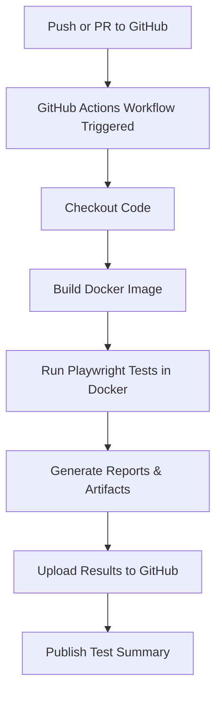

# 🚀 Easy GitHub Actions Integration for Playwright E2E Tests

## How It Works



## 5 Simple Steps

### 1️⃣ Dockerize Your Tests
```dockerfile
FROM mcr.microsoft.com/playwright:v1.56.1-jammy
WORKDIR /app
COPY package*.json ./
RUN npm ci
COPY . .
```

### 2️⃣ Create Workflow File
`.github/workflows/test.yml`
```yaml
name: E2E Tests
on: [push, pull_request]
jobs:
  test:
    runs-on: ubuntu-latest
    steps:
      - uses: actions/checkout@v4
      - uses: docker/setup-buildx-action@v3
      - name: Build & Test
        run: |
          docker build -t e2e-tests .
          docker run --rm \
            -e CI=true \
            -v "$(pwd)/test-results:/app/test-results" \
            e2e-tests npx playwright test
```

### 3️⃣ Configure Playwright
```typescript
export default defineConfig({
  reporter: [
    ['html', { outputFolder: 'test-results/report' }],
    ['junit', { outputFile: 'test-results/junit.xml' }]
  ],
  use: {
    video: 'retain-on-failure',
    screenshot: 'only-on-failure'
  }
});
```

### 4️⃣ Upload Artifacts
```yaml
- uses: actions/upload-artifact@v4
  if: always()
  with:
    name: test-results
    path: test-results/
    retention-days: 30
```

### 5️⃣ Add Test Summary
```yaml
- name: Publish Results
  if: always()
  run: |
    echo "## Test Results" >> $GITHUB_STEP_SUMMARY
    echo "Status: ${{ job.status }}" >> $GITHUB_STEP_SUMMARY
```

## ✨ Benefits
- Runs tests on every commit
- Parallel execution with matrix strategy
- Automatic HTML reports & artifacts
- Docker ensures consistent environment
- No more "works on my machine" issues

## Pro Tips
- Use Docker layer caching to speed up builds
- Run critical tests (smoke) first with matrix strategy
- Handle empty test suites gracefully with pre-checks

---
Full implementation available on GitHub: [your-repo-link]

#Playwright #TestAutomation #CI #CD #GitHubActions #QA #Testing #DevOps
